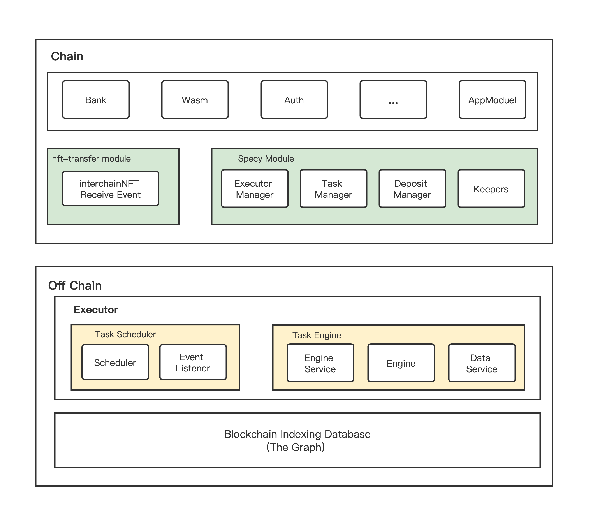
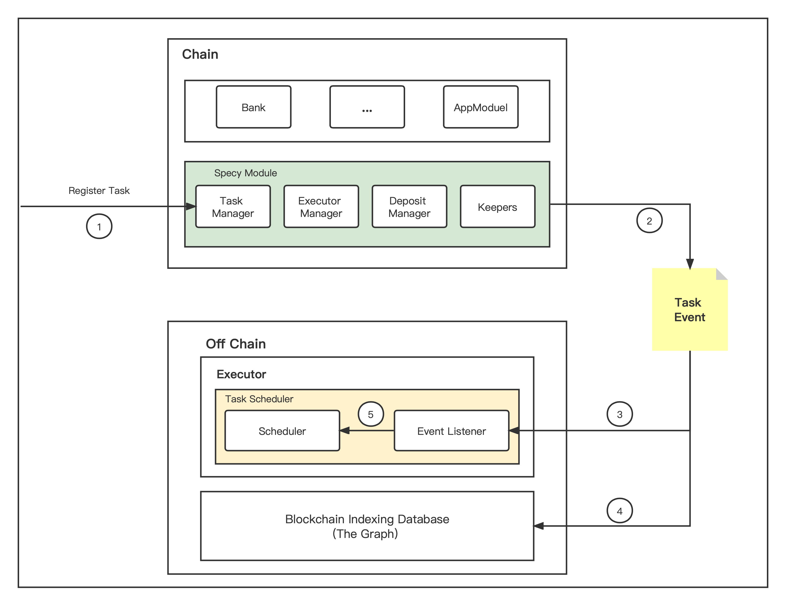
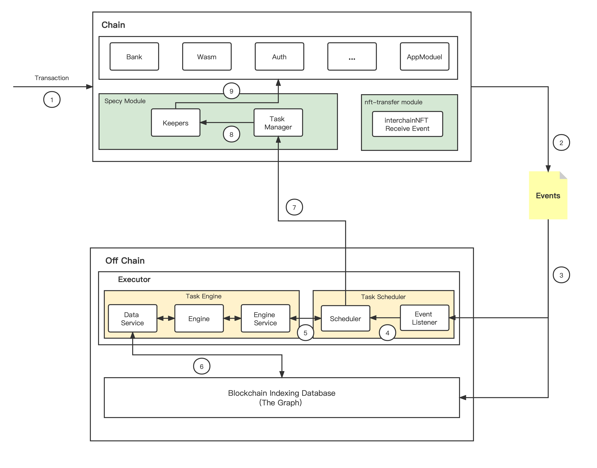
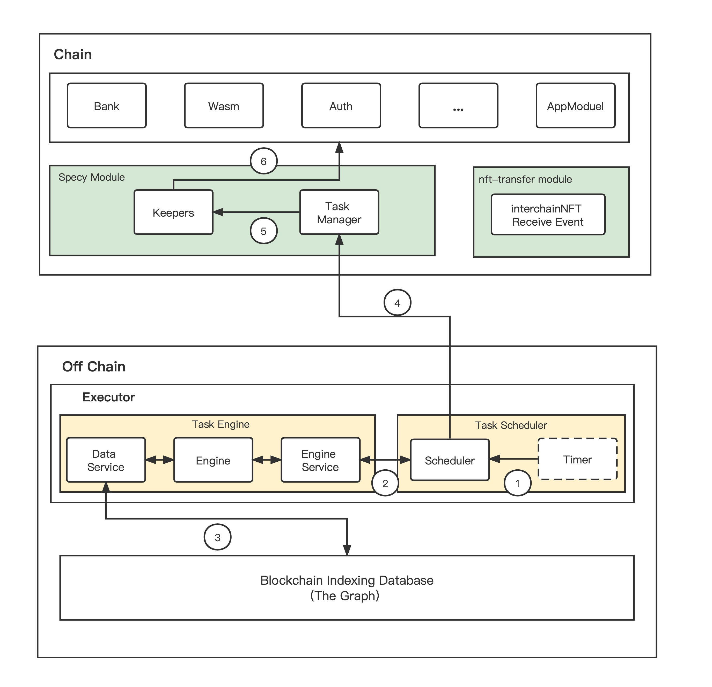
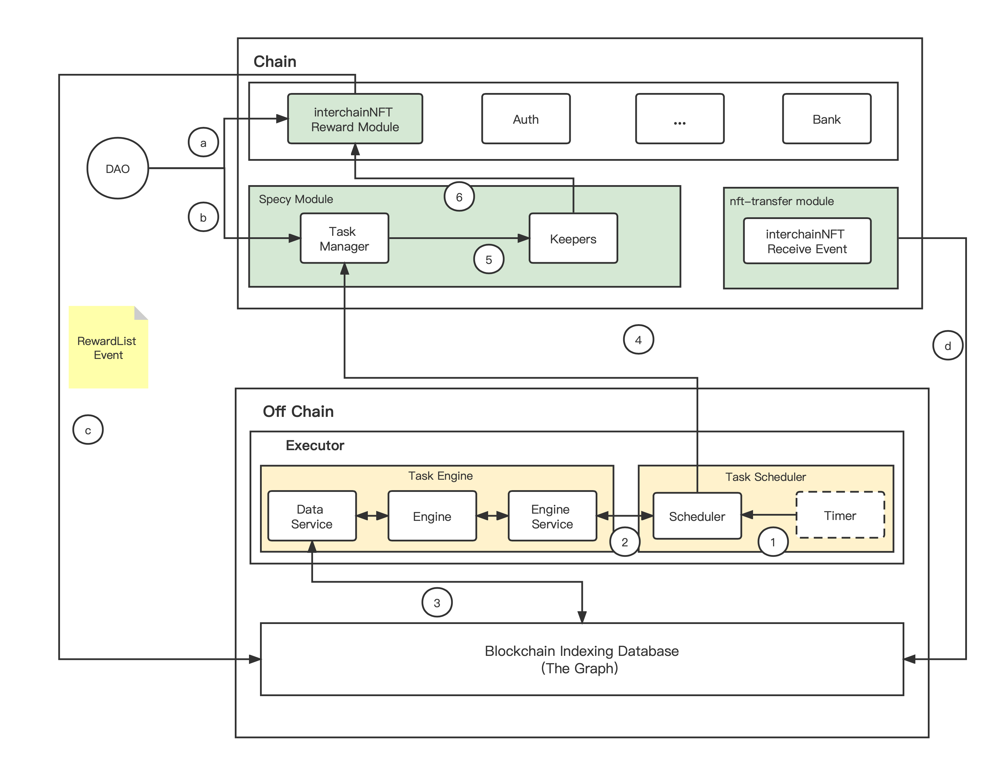
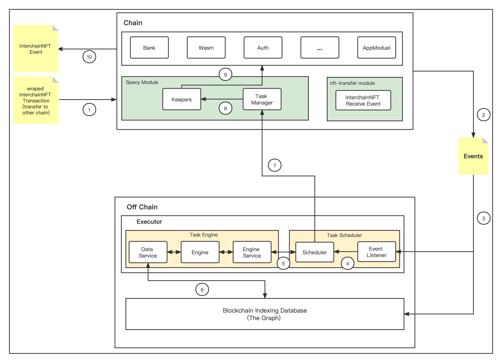
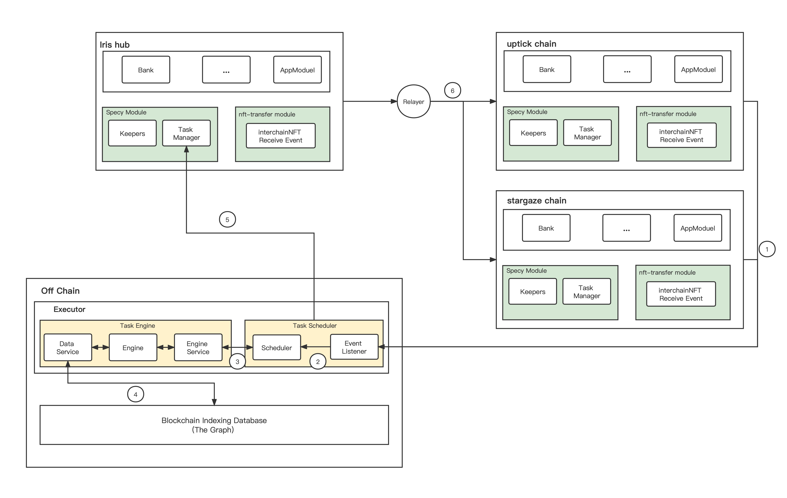

# What is specy network

Specy network is cosmos's decentralized and interchainNFT-aware automation network helping developers to create automated and gasless interchainNFT Dapp.

## Service

- **Automation:** Automated your Dapp by timer or specific event on chain. 

## Vision
**Specy networ is the automation engine of cosmos ecosystem.**

# How it work
There are two main charactors on the specy network, user and executor. Users can register their task and executor will  execute the registered task. In return, executor will get a small fee. 

Typically, users can specify task's logic by writing the script language designed by Specy Network. The script language will be one of the field of task msg.

## Benefits

- **Decentralize**: Tasks are store in the chain and multiple Executors are operating task with a simple PoS consensus.

- **Interchain-Aware**: Executors can collect multi-chain information and help users make a better decision.

- **Reliable**: Task will be run in the SGX enviroment, and the result will return with a proof.

# Architecture

## On Chain
- **nft-trasfer module**

    To adapt the Specy network with ICS-721 protocol, we do an enhancement of the `nft-transfer module`, a new event called `interchainNFT receive event` used to inform that there is a new NFT has been transfered to the chain.

- **Specy Module**

    `Specy Module` is a cosmos module used to handle task, deposit and executor. It's main functions include
    - **Task Manage**: task register, task update, task cancel, .et
    - **Executor Manage**: executor selection, executor register, et.el
    - **Deposit Manage**: manage executor's deposit and user's deposit.
    - **Proxy tasks**: execute task by using registered keepers.

## Off Chain
- **Task Scheduler**

    Task Scheduler is used to schedule task. It has a Event Handler used to listen events from chains, and a Scheduler used to schedule tasks when the task's condition meet. 

- **Task Engine**

    Task Engine is used to execute the task scheduled by Task Scheduler.

    - **Engine Service**: a gRPC service used to communicate with Task Scheduler.
    - **Engine**: a interpreter running inside the SGX enviroment used to execute task following the logic of task's script with on-chain datas.
    - **Data Service**: used to query data from database.

# Automation
## Register Task

1. User register task.
2. Specy Module emit an task event.
3. Task Scheduler's event listener receive Task Event.
4. The Graph receive and store Task Event.
5. Create a new task schedule for receiving Task Event.

## Execute Task
- **Triger by Event**

1. A new transaction from users.
2. Chain emit an new event.
3. Task Scheduler's event listener and The Graph receive Task Event.
4. Scheduler found that this event statisfy a condition of a task.
5. Scheduler Schedule this task and send a task executing request to Task Engine.
6. Task Engine receive the request and execute the task' s script file inside Engine with data from The Graph.
7. Scheduler pack the task result into an transaction and send it to the Chain.
8. Task Manager verify the result and execute task's target function by using registered Keepers.
9. Keeper will execute the target function.
- **Triger by Timer**

1. Task Scheduler will keep a timer to handle timed task. Timer can activate Scheduler like Event Listener do.
2. Scheduler Schedule the task and send a task executing request to Task Engine.
3. Task Engine receive the request and execute the task' s script file inside Engine with data from The Graph.
4. Scheduler pack the task result into an transaction and send it to the Chain.
5. Task Manager verify the result and execute task's target function by using registered Keepers.
6. Keeper will execute the target function.

# Use cases on InterchainNFT
## InterchainNFT Reward & Tax

This idea is from the first challenge of the Stargaze track. Stargaze want to pay an incentive for NFTs that come to Stargaze and take some tax for NFTs that tansfer to another chain.

Specy Network can help to implement this mechanism. 

### InterchainNFT Reward

Similiar to `looksrare's` trading reward, the interchainNFT Reward we designed are calculated daily and users can claim their rewards after the end of each day.

**Preparation**

a.The DAO decide which kinds of NFTs should be reward, and send it to the interchainNFT Reward Module as a list.

b.The DAO register a daily task of updating the list of rewarded users to the Specy Module.

c.After receive the list, interchainNFT Reward Module will emit an RewardList event, and there is a subgraph used to handle the event.

d.There is another subgraph used to handle interchainNFT Receive Event.

**Automation**

1.As the task's config, Timer will triger the Scheduler every 24 hours.

2.Scheduler send the task request to Task Engine.

3.Task Engine static interchainNFTs which satistied the condition of the Reward NFT List within one day and return the merkle root of their receiver's address as a result with a proof.

4.Send the result and the proof to the Specy Module.

5.Verify and execute task.

6.Update the merkle root by using interchainNFT's keeper.

**Claim**

User's can claim their reward after the merkle root has been updated.

**Demo Vedio**

TODO

## InterchainNFT Tax (Developing)

## Limit Order for InterchainNFT Transaction (Developing)
